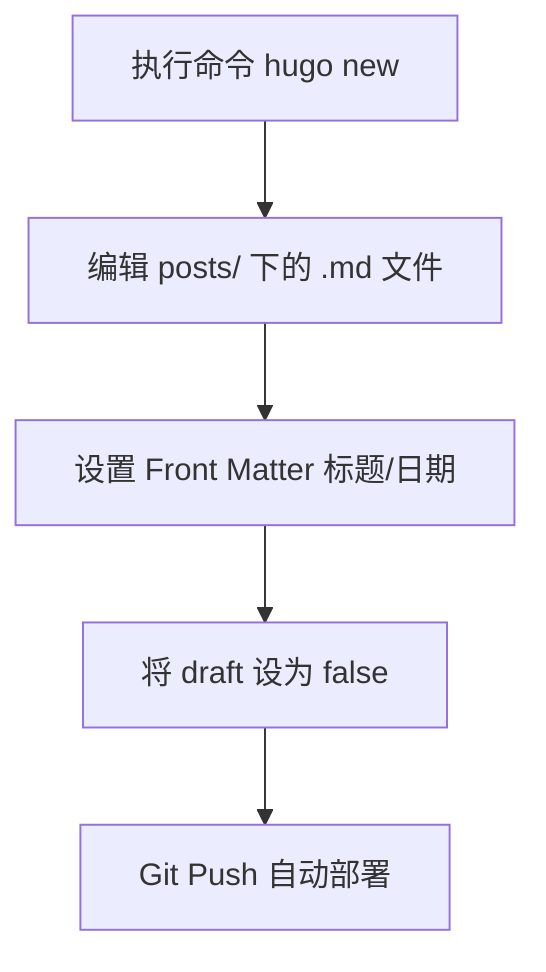

# 🌐 Blowfish 网站完整使用与操作手册

本手册为您提供 Blowfish 主题网站的**全量参数说明**、日常维护及高级功能配置指南。

---

## 📍 当前站点状态 (Current Status)

目前您的站点正在使用 **`layout = "page"`** 极致简约布局。

- **效果**：移除了首页所有的背景图、大标题和头像块，直接将“最近的文章”置顶显示。
- **关联文件**：
    - 配置：[params.toml](config/_default/params.toml) -> `layout = "page"`
    - 内容：[content/_index.md](content/_index.md) (保持为空以消除首页文字)

---

## ✅ 仓库上传规则（只提交网站源文件）

Hugo 官方文档明确：`public/`（构建输出）与 `resources/`（管线缓存）会在运行 `hugo` / `hugo server` 时自动生成并可被重建，因此**不应上传到仓库**。同理，本地编辑器/AI 工具配置也属于个人环境，不应进入仓库。

### 允许上传（网站相关）
- `content/`：文章与页面内容（含 Page Bundle 图片/附件）
- `config/`：站点配置
- `layouts/`、`assets/`、`static/`、`archetypes/`：模板与资源
- `themes/`：主题源码（当前仓库为直接包含主题目录的方式）
- 文档：`README.md`、`MANUAL.md`、`THEME_CONFIG.md`

### 禁止上传（生成物/缓存/本地环境）
- `public/`、`resources/`、`.hugo_build.lock`
- `.vscode/`、`.idea/`、`.claude/`、`node_modules/`
- `.env*`、`*.key`、`*.pem`

### 每次推送前必做
- 先运行 `git status --short`，确认待提交列表里没有上述“禁止上传”的路径。

---

## 🖼️ 更换浏览器标签页图标（Favicon / Web App 图标）

你在浏览器标签页看到的“小图标”来自主题在 `<head>` 中引用的固定文件名（不是通过某个 TOML 参数配置）。Blowfish 默认会引用这些文件：

- `favicon.ico`
- `favicon-16x16.png`
- `favicon-32x32.png`
- `apple-touch-icon.png`
- `android-chrome-192x192.png`
- `android-chrome-512x512.png`
- `site.webmanifest`

### 推荐方式（不改主题，便于以后升级主题）
在项目根目录创建 `static/` 文件夹，并把上述文件放到 `static/` 根下（例如 `static/favicon.ico`）。Hugo 会优先使用项目里的同名文件，从而覆盖主题自带图标。

### 当前项目的做法（你这次采用）
你是直接覆盖了主题目录里的图标文件：`themes/blowfish/static/` 下的同名文件。
这种方式也能生效，但如果未来更新主题，可能会被主题更新覆盖，需要你再做一次同样的替换。

---

## 🛠 一、 全局站点配置 (hugo.toml)
*控制网站的基础行为和元数据。*

| 参数 | 说明 | 默认值/示例 |
| :--- | :--- | :--- |
| `baseURL` | 网站部署后的完整域名 | `"https://your-site.com/"` |
| `theme` | 指定使用的主题名称 | `"blowfish"` |
| `defaultContentLanguage` | 默认语言 | `"en"` |
| `[pagination].pagerSize` | 每页显示的文章数量 | `20` |
| `summaryLength` | 首页文章摘要的字数限制 | `30` |
| `enableEmoji` | 是否在文章中支持 Emoji 表情 | `true` |
| `buildDrafts` | 是否构建标记为 draft (草稿) 的文章 | `false` |

---

## 🎨 二、 主题功能配置 (params.toml)
*核心功能开关，决定网站“长什么样”。*

### 1. 基础外观 (Global)
- `colorScheme`: 配色方案。可选：`blowfish` (默认), `congo`, `ocean`, `forest` 等。
- `defaultAppearance`: 默认外观模式。可选：`light` (浅色), `dark` (深色)。
- `autoSwitchAppearance`: 是否根据系统设置自动切换深浅色。
- `enableSearch`: 是否开启右上角全局搜索。
- `enableCodeCopy`: 代码块是否显示一键复制按钮。

### 2. 导航栏设置 (Header)
- `layout`: 导航栏布局。
    - `fixed`: 固定在顶部，随页面滚动。
    - `basic`: 随页面滚动而消失。

### 3. 页脚设置 (Footer)
- `showCopyright`: 是否显示版权信息。
- `showThemeAttribution`: 是否显示主题来源声明。
- `showAppearanceSwitcher`: 是否显示深浅色切换按钮。
- `showScrollToTop`: 是否显示回到顶部按钮。

### 4. 首页设置 (Homepage)
- `layout`: **(核心)** 首页展示模式。
    - `page`: **(当前使用)** 使用 `_index.md` 内容，最简约。
    - `card`: 纯文章卡片流。
    - `hero`: 大图欢迎背景 + 标题。
    - `profile`: 个人头像 + 简介居中。
- `showRecent`: 是否在首页显示“最近的文章”列表。
- `showRecentItems`: 首页显示的最近文章数量（默认 5）。
- `cardView`: 首页文章是否以卡片形式展示（false 为列表）。

### 5. 文章页面设置 (Article)
- `showDate`: 显示发布日期。
- `showReadingTime`: 显示预计阅读时间。
- `showWordCount`: 显示总字数。
- `showTableOfContents`: 开启文章右侧/顶部目录。
- `heroStyle`: 详情页顶部封面样式 (`basic`, `big`, `background`)。
- `showAuthor`: 页面底部是否显示作者信息卡片。

---

## 👤 三、 个人信息与多语言 (languages.en.toml)
*定义您是谁，以及站点显示的文字内容。*

### 1. 站点元数据
- `title`: 网站名称（显示在浏览器标签页）。
- `description`: 网站描述（对 SEO 非常重要）。
- `dateFormat`: 日期格式（如 `"2 January 2006"`）。

### 2. 作者信息 (params.author)
- `name`: 您的名字。
- `image`: 头像路径（存放于 `assets/img/`）。
- `headline`: 一句话简介。
- `bio`: 详细的自我介绍。
- `links`: 社交链接列表（支持 GitHub, Twitter, Email 等）。

---

## 📝 四、 日常维护操作流程

### 1. 发布新文章

### 2. 常用维护命令（Hugo 官方方式）
| 命令 | 用途 |
| :--- | :--- |
| `hugo server -D` | 本地预览（包含草稿） |
| `hugo server` | 本地预览（不含草稿） |
| `hugo new posts/my-post/index.md` | 创建新文章（Page Bundle 结构，推荐） |

---

## 🚀 五、 进阶：内容增强组件 (Shortcodes)
*在 Markdown 中直接复制以下代码使用。*

- **警告框 (Alert)**: ` 提示文字 `
- **按钮 (Button)**: ` 文字 `
- **流程图 (Mermaid)**: ` graph TD; A-->B; `

---

*更多技术细节请查阅：[Blowfish 官方配置文档](https://nunocoracao.github.io/blowfish/docs/configuration/)*
